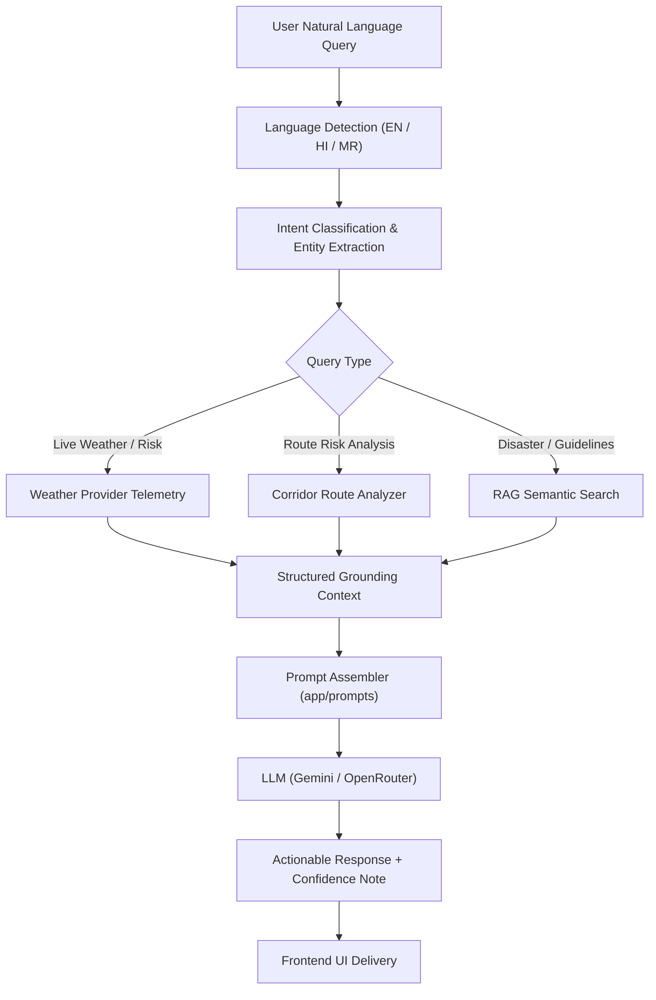

# WeatherGPT — AI Architecture & Natural Language Copilot

WeatherGPT integrates generative AI with real-time sensor and NWP model telemetry to deliver grounded, persona-adapted weather intelligence.

## 1. Grounded Architecture Pipeline

## 2. Anti-Hallucination Directives
1. **No Data Fabrication**: If live radar or weather telemetry is unavailable, the model explicitly declares data absence rather than hallucinating atmospheric readings.
2. **Confidence Index**: Every AI response calculates and reports an objective confidence score (50–100%) reflecting forecast horizon, data completeness, and source reliability.
3. **Structured Attribution**: Internal metadata tracks `data_sources`, `location`, and `timestamp` alongside the natural language response.

## 3. Operational Personas
- **Farmer / Kisan Mode**: Tailored for agro-meteorology — soil saturation, spraying windows, crop irrigation thresholds, and harvest protection.
- **Traveller / Highway Copilot**: Focuses on driving visibility, ghat landslide risks, aquaplaning hazards, and optimal departure windows.
- **Disaster Response & Control**: Direct, high-urgency directives on river basin levels, dam discharge (cusecs), inundation zones, and relief shelter coordinates.
- **School & Campus Safety**: Morning bus commute safety, wet-bulb heat thresholds for sports grounds, and lightning shelter protocols.
- **General Public**: Conversational day-to-day comfort, clothing, and UV protection advice.
