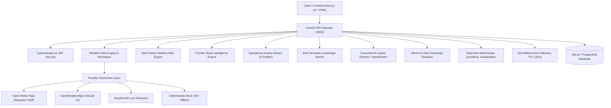

# WeatherGPT — System Architecture & Design Specification

## 1. Executive Architectural Overview

**WeatherGPT** is a high-availability, modular meteorological decision-support and disaster copilot platform engineered for national-scale weather monitoring, smart city administration, agricultural advisory, route planning, and emergency response.

---

## 2. Core Subsystems

### 2.1 Multi-Provider Weather Data Engine
- **Decoupled Architecture**: All weather requests flow through `BaseWeatherProvider` and are normalized into strict Pydantic schemas (`WeatherData`, `ForecastData`, `HourlyForecast`, `DailyForecast`).
- **Provider Switching**: Seamless configuration via `WEATHER_PROVIDER=openmeteo|openweather|weatherapi|mock`.
- **Zero-Key Reliability**: Open-Meteo NWP Consensus provides global zero-key operational forecasting with GFS/ECMWF assimilation, ensuring the system never fails when third-party API quotas are exhausted.

### 2.2 Dedicated Multi-Factor Risk Engine
The Weather Risk Score is calculated as an objective index from 0 to 100:
$$\text{Risk} = f(\text{Precipitation}, \text{Wind Gusts}, \text{Thermal Extremes}, \text{Visibility}, \text{Topography}, \text{Alerts})$$
- **0–25 (LOW - Emerald)**: Safe baseline conditions.
- **26–50 (MODERATE - Amber)**: Cautionary parameters (drizzle, moderate crosswinds).
- **51–75 (HIGH - Orange)**: Significant disruption (heavy showers, waterlogging risk, ghat fog).
- **76–100 (SEVERE - Red)**: Imminent life/property hazard (cloudburst, flash flood, squall gale > 90 km/h).

### 2.3 Route Weather Intelligence
- Samples key transit checkpoints along transportation corridors (e.g. Pune $\rightarrow$ Lonavala $\rightarrow$ Khopoli $\rightarrow$ Panvel $\rightarrow$ Mumbai).
- Computes individualized checkpoint risks, identifies the most dangerous transit corridor, and calculates optimal departure timing windows.

### 2.4 RAG (Retrieval-Augmented Generation) Knowledge Base
- Ingests authoritative NDMA Disaster Protocols, IMD Meteorological Bulletins, WMO WIS 2.0 standards, and ICAR agricultural advisory guidelines.
- Employs TF-IDF and Cosine Vector Space similarity search to retrieve and cite verified emergency and meteorological protocols with confidence ratings.

### 2.5 Real-Time WebSocket Telemetry
- `/api/ws/alerts`: Broadcasts real-time national and municipal weather warnings.
- `/api/ws/weather/{city}`: Pushes live meteorological parameter streams with automatic ping-pong keepalive.
