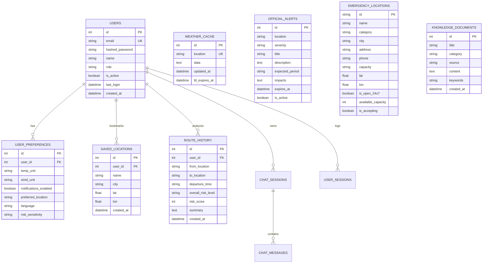

# WeatherGPT — Database Schema & Data Models

WeatherGPT utilizes SQLAlchemy ORM with a normalized relational schema supporting SQLite in local/demo deployments and PostgreSQL in production environments.

## Entity Relationship Architecture

## Table Specifications

### 1. `users`
- Stores user credentials, BCrypt password hashes, account roles (`general`, `farmer`, `traveller`, `disaster`, `school`), and lifecycle timestamps.

### 2. `user_preferences`
- Stores unit settings (`celsius`/`fahrenheit`, `kmh`/`mph`/`ms`), language preferences (`en`, `hi`, `mr`), and risk sensitivity factors.

### 3. `saved_locations`
- Bookmarked cities and GPS coordinates for fast one-tap dashboard access.

### 4. `weather_cache`
- Persistent secondary cache tier with JSON payloads and explicit `ttl_expires_at` invalidation timestamps.

### 5. `emergency_locations`
- Relief shelters, tertiary hospitals, and NDRF/SDRF disaster response command bases with real-time capacity and contact numbers.

### 6. `knowledge_documents`
- Curated disaster guidelines, IMD meteorological standards, and agricultural mitigation strategies for RAG indexing.
