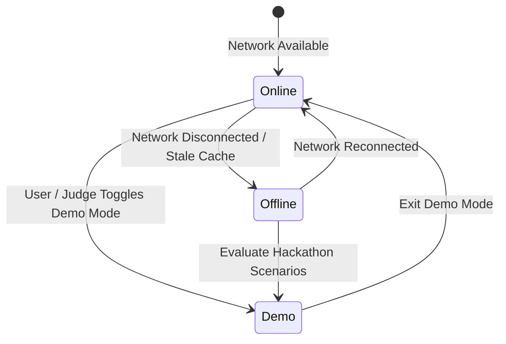

# WeatherGPT — Tri-Mode Architecture: Online, Offline & Demo

WeatherGPT is designed to operate seamlessly across three network environments:

---

## 1. Online Mode
- Queries live NWP consensus models (Open-Meteo, ECMWF, GFS, IMD).
- Real-time WebSockets push alerts and live meteorological observations.
- Stores responses in dual-tier cache: Sub-millisecond Memory Cache (180s TTL) and SQLite/PostgreSQL Database Cache (5-minute TTL).

---

## 2. Offline Mode (PWA & Local Cache)
- Handled by Service Worker (`frontend/public/sw.js`) and Browser `localStorage` / IndexedDB.
- When network disconnects:
  1. Displays prominent **Offline Mode** indicator.
  2. Renders last cached weather snapshot, 7-day forecast, and route intelligence results.
  3. Displays explicit timestamp: *"Last synced 14 minutes ago"*.
  4. Keeps AI Chat operational using local heuristic grounding and offline responses.

---

## 3. Demo Mode (Smart India Hackathon Ready)
- **Zero Configuration**: Functions without requiring external API credentials or third-party uptime.
- High-fidelity deterministic datasets for key metropolitan hubs (Pune, Mumbai, Delhi, Bengaluru, Nashik, Chennai, Kolkata).
- Interactive **Disaster & What-If Simulations**:
  - Khadakwasla Dam discharge simulation (+35,000 cusecs).
  - Cloudburst and intense rainfall simulations (+65 mm/hr).
  - Severe Heatwave scenarios (+44.5°C).
  - Cyclone landfall and squall gale simulations (95 km/h).
- Dedicated **Demo Mode Badge** in the top navigation bar for immediate judge visibility.
