# WeatherGPT — RAG (Retrieval-Augmented Generation) Pipeline

WeatherGPT incorporates a dedicated RAG pipeline to answer knowledge-oriented meteorological and disaster safety questions.

## 1. Pipeline Flow

```mermaid
graph LR
    UserQ["Knowledge Question"] --> Tokenizer["Alphanumeric Tokenizer"]
    Tokenizer --> Vectorizer["Query TF-IDF Vector"]
    Vectorizer --> Similarity["Cosine Vector Distance Matching"]
    Similarity --> Filter["Keyword & Threshold Filter"]
    Filter --> Documents["Top-K Authoritative Documents"]
    Documents --> Synthesizer["Grounded AI Synthesizer"]
    Synthesizer --> Output["Answer with Official Citation & Confidence"]
```



## 2. Indexed Knowledge Catalog
1. **NDMA Lightning Safety & 30-30 Rule**: Electrical discharge mechanics, crouch positions, and safety waiting intervals.
2. **Urban Flooding & Flash Flood Mitigation**: Inundation hazards, depth thresholds (15 cm vs 30 cm vs 60 cm), and evacuation procedures.
3. **Extreme Heatwave & Wet-Bulb Temperature**: WBGT index limits, dehydration first aid, and ORS protocols.
4. **Tropical Cyclone Categorization**: IMD wind velocity scales (Deep Depression to Super Cyclone), landfall precautions, and eye-of-cyclone warnings.
5. **Global Solar UV Index**: WMO scales (1 to 11+), SPF requirements, and solar peak exposure limits.
6. **National Air Quality Index (NAQI)**: Pollutant classifications, PM2.5/PM10 health impacts, and N95 respirator advisories.
7. **Convective Available Potential Energy (CAPE)**: Atmospheric buoyancy, orographic cloudburst dynamics, and radar nowcasts.
8. **ICAR Agro-Meteorology Standards**: Spraying wind windows (<15 km/h), irrigation postponement, and grain storage moisture limits.

## 3. Grounding Verification
When a user asks questions such as *"What does UV index 9 mean?"* or *"What precautions should I take during lightning?"*, the system retrieves the verified document and provides an authoritative response with confidence scores:
```json
{
  "title": "Lightning Safety & 30-30 Rule (NDMA / IMD)",
  "source": "NDMA Lightning Safety Manual",
  "confidence_percent": 98,
  "similarity_score": 0.82
}
```
