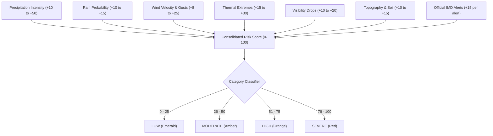

# WeatherGPT — Dedicated Weather Risk Engine

The **Weather Risk Engine** (`app/services/risk_service.py`) calculates an objective, transparent meteorological risk index from 0 to 100.

## 1. Risk Formulation & Weight Matrix



## 2. Parameter Weights

| Factor | Threshold | Weight | Operational Impact |
|--------|-----------|--------|-------------------|
| Cloudburst / Intense Rain | Rain condition / >65 mm/hr | +50 | Flash flood & drainage collapse |
| Thunderstorm / Lightning | Thunder condition | +35 | Structural hazard & power disruption |
| Gale Winds | >40 km/h | +25 | Flying debris & vehicle rollover |
| Extreme Heatwave | $\ge 40^\circ\text{C}$ | +30 | Heat stroke & electrical grid overload |
| Heavy Fog / Low Visibility | $<2.0\text{ km}$ | +20 | Highway multi-vehicle collision risk |
| Ghat Topography | Hilly / Ghat pass | +15 | Landslide & boulder fall vulnerability |
| Active Government Warning | Per active alert | +15 | Regulatory and civic disruption |

## 3. Explanations & Transparency
Unlike opaque black-box models, the Risk Engine returns an explicit breakdown of all active factors:
```json
{
  "score": 68,
  "category": "HIGH",
  "color": "orange",
  "breakdown": [
    {"factor": "Heavy Rainfall / Thunderstorm", "weight": 35, "icon": "cloud-rain"},
    {"factor": "Ghat Topography - Landslide Vulnerability", "weight": 15, "icon": "mountain"},
    {"factor": "Very High Precipitation Probability (>80%)", "weight": 15, "icon": "droplet"}
  ]
}
```
