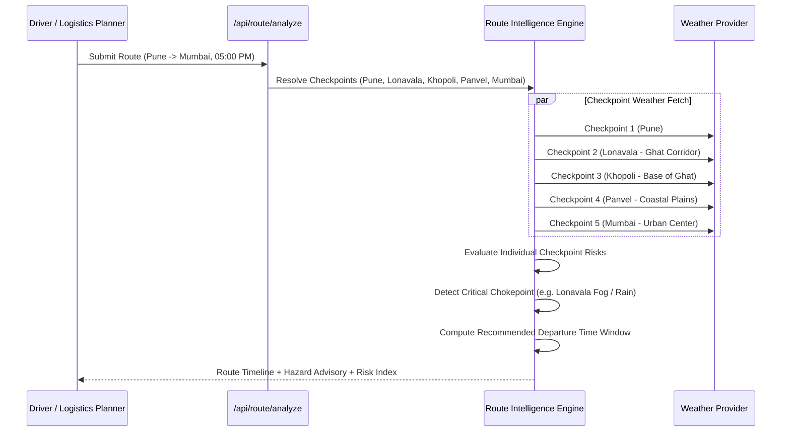

# WeatherGPT — Route Weather Intelligence

Weather Route Intelligence (`app/services/route_service.py`) analyzes meteorological threat vectors along transportation corridors to recommend safe departure windows.

## 1. Corridor Sampling Architecture

## 2. Dynamic Corridor Output
Each transit waypoint provides localized metrics:
- **Temperature & Feels Like**
- **Precipitation Probability & Intensity**
- **Wind Speed & Crosswind Shears**
- **Horizontal Visibility & Fog Risk**
- **Checkpoint-Specific Risk Level** (`LOW`, `MODERATE`, `HIGH`, `SEVERE`)

## 3. Intelligent Departure Recommendation
The engine inspects hourly projections along the route corridor to identify safer departure windows:
> *"Heavy rain and dense fog detected at Lonavala Ghat between 05:00 PM and 07:30 PM. Recommended departure: Leave before 03:30 PM or after 08:00 PM for optimal road friction and visibility."*
